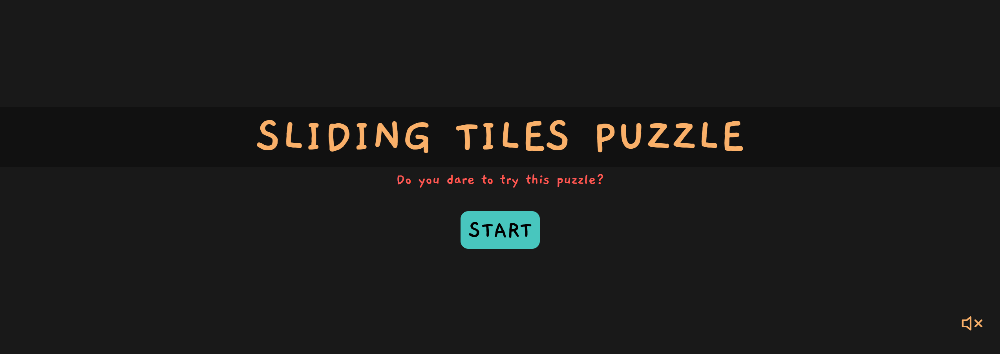
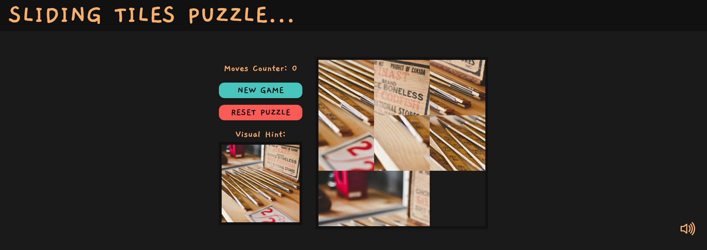
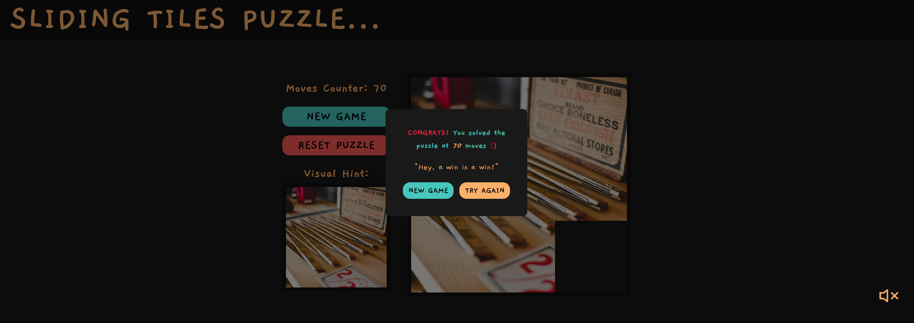

# 🧩 Sliding Tiles Puzzle

A modern implementation of the classic 3x3 sliding puzzle game built using **Blazor**, with a responsive and clean user interface powered by HTML, CSS, JavaScript, and Bootstrap.

---

## 🎮 Features
- Interactive 3x3 sliding puzzle
- Responsive UI design (desktop & mobile)
- Smooth tile movements
- Win state detection
- Background music for enhanced gameplay experience
- Clean Bootstrap-styled layout

---

## 🖥️ UI Preview

### Home Interface


### Main Game Interface


### Winning State


---

## 🚀 How to Play
1. Start the game with a shuffled board.
2. Click a tile next to the empty space to move it.
3. Arrange the tiles in order.
4. Complete the puzzle to win! 🎉

---

## 🛠️ Tech Stack
- **Blazor** (C#)
- **HTML5**
- **CSS3**
- **JavaScript**
- **Bootstrap**

---

## 📦 Installation & Setup

1. Clone the repository:
```bash
git clone https://github.com/hestoya/SlidingTilesPuzzle.git
